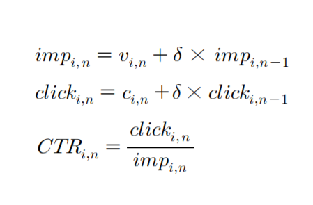

# 기계학습 기반의 뉴스 추천 서비스 구조와 그 효과에 대한 고찰: 카카오 루빅스를 중심으로

## 요약
루빅스는 다양한 추천 알고리즘으로 구성된 앙상블 추천 시스템으로 맞춤형 멀티암드밴딧 중심의 뉴스 추천 시스템을 설명한다.

[앙상블 추천 시스템이란?]()  
[멀티암드 밴딧이란?]()

# 서론 및 논의 배경
1. 기계 학습 기반의 추천 시스템  
* 내용 기반 필터링 : 각 콘텐츠의 메타 정보에서 특성을 추출하고, 이용자가 선호했던 콘텐츠에서 자주 나타나는 특성을 추출해 이용자의 선호도 프로파일을 만든 다음, 새로 유입되는 콘텐츠 중 생성된 프로파일과 유사한 콘텐츠를 추천
* 협업 필터링: 이용자와 콘텐츠 소비 성향이 비슷한 유사 이용자를 찾아내고, 이용자가 소비하지 않았지만 유사 이용자군에서 많이 소비된 콘텐츠를 추천해주는 체계

이 두가지 방법에는 모두 장단점이 존재하므로 hybrid 알고리즘의 개발이 중요시된다.

2. 뉴스 추천 알고리즘
구글과 야후의 예시.  
**구글** 뉴스의 초기 추천 알고리즘은 동시방문수, 민해쉬(MinHash), 그리고 PLSI라는 세 가지 협업 필터링 방식을 결합한 앙상블 알고리즘으로 구성  
**야후**는 야후의 에디터가 품질 높은 뉴스들을 선정한 뒤, 이용자가 가장 좋아할만한 콘텐츠를 노출 영향도가 가장 높은 지역에 배치하는 것

# 루빅스 알고리즘에 대한 설명
* 필요: 카카오에게는 하나의 뉴스 서비스 화면에 20개 내외의 뉴스만 노출되는 공간 부족 문제를 해결할 수 있는 시스템이 필요  
--> 이용자의 뉴스 소비 패턴에 따라 뉴스의 노출과 배열이 효율적으로 결정되는 체계를 구축  
--> 카카오의 뉴스를 소비하는 이용자 대부분은 이용자 행동 정보가 거의 없는 '콜드 스타트 이용자'  
--> 이러한 이용자에 대해서는 개인화 추천 알고리즘을 적용하기 어렵다.    
--> 맞춤형 멀티암드밴딧을 고안  

* 맞춤형 멀티암드밴딧  
이동 평균 알고리즘을 사용해서 구현. (이전에 등장하는 Softmax, UCB,입실론-그리디에서 카카오에게 가장 적합한 알고리즘을 이용하기 위해 이동평균알고리즘을 도입)  
  
출처: 기계학습 기반의 뉴스 추천 서비스 구조와 그 효과에 대한 고찰: 카카오 루빅스를 중심으로 논문 21page  

위 수식에 더하여 화면 내의 위치에 따라 변하는 클릭률을 보정하기 위해 N개의 위치가 있다면 모든 위치에서 `1/N * 총 탐색수`만큼 동일하게 검증하고, 이들의 평균을 클릭률로 계산하는 방법을 취함.

이용자 집단별 최적화를 위해 스포츠 영역에서는 `클러스터링` 방식을 취하고, 연령대 및 성별은 `각 이용자 집단의 뉴스 소비 패턴에 근거한 추천` 방식을 채택.  

